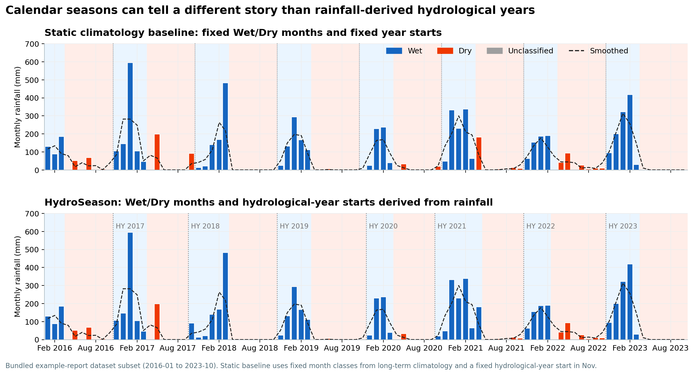

# HydroSeason

Hydrological seasons do not always follow the calendar.

HydroSeason helps you turn rainfall records into Wet/Dry seasons,
hydrological years, rainfall metrics, diagnostics, plots, and a self-contained
HTML report. You can bring your own rainfall table, or provide a catchment or
area-of-interest polygon and let HydroSeason fetch monthly rainfall from SILO,
CHIRPS, or ERA5.

[Open the example report](report.md){ .md-button .md-button--primary }
[Start with the quick guide](quickstart.md){ .md-button }


## Why Use It?

Calendar years are easy, but rainfall seasons often shift. A wet season can
start early, end late, or cross a reporting boundary. Those details can change
annual rainfall totals, dry-season length, drought classification, and the way
surface-water or ecological patterns are interpreted.

HydroSeason uses the rainfall record itself to label Wet/Dry seasons and assign
hydrological years. It also records diagnostics so the result is inspectable,
not just a black-box label.

| Common static approach | HydroSeason |
| --- | --- |
| Uses calendar years or one fixed water-year start | Assigns hydrological years from rainfall season timing |
| Assumes Wet/Dry months are fixed | Refines Wet/Dry labels year by year |
| Can split one wet season across two reporting years | Keeps rainfall grouped by hydrological season |
| Requires rainfall data to be prepared separately | Can fetch area-averaged rainfall from a polygon |
| Gives limited method diagnostics | Exports thresholds, confidence notes, plots, and a report |



The top panel uses a fixed Nov-Oct hydrological year and fixed Wet/Dry months.
The bottom panel lets the rainfall record decide where wet/dry seasons and
hydrological years begin.

## What HydroSeason Produces

The high-level API returns a `PipelineArtifacts` object with:

| Artifact | Meaning |
| --- | --- |
| `result` | The labelled monthly DataFrame with `SeasonType`, `Hydro_Year`, diagnostics copied onto rows, and annual wet/dry metrics. |
| `fixed_monthly` | The 12-month climatology table used to define the fixed baseline Wet/Dry seasons. |
| `wet_boundaries` | Per-year dynamic wet-season start/end dates when a seasonal regime is detected. |
| `seasonality` | STL and Walsh-Lawler seasonality diagnostics. |
| `diagnostics` | A compact report of method decisions, thresholds, validation warnings, and hydrological-year start month. |

## Two Ways To Start

### I already have rainfall data

```bash
pip install hydroseason
```

```python
import pandas as pd
from hydroseason import classify_rainfall, generate_html_report

df = pd.read_csv("data/monthly_rainfall.csv")
artifacts = classify_rainfall(df)
generate_html_report(artifacts, "output/hydroseason_report.html")
```

### I have a polygon and need rainfall

```bash
pip install "hydroseason[fetch]"
```

```python
from hydroseason import (
    classify_rainfall,
    generate_html_report,
    get_monthly_aoi_rainfall,
    load_vector,
)

gdf = load_vector("catchment.geojson")

monthly = get_monthly_aoi_rainfall(
    gdf,
    start_year=1985,
    end_year=2023,
    source="auto",
    cache_dir="data/fetch_cache",
)

artifacts = classify_rainfall(monthly)
generate_html_report(artifacts, "output/hydroseason_report.html")
```

Auto fetch uses SILO for Australian catchments and CHIRPS v3 monthly rainfall
elsewhere. ERA5 remains available as an explicit exact path or as a backup when
CHIRPS cannot cover the requested range.
The [Rainfall Fetch](fetch.md) page has the full Python and command-line
examples.

## Install

The core install includes rainfall validation, classification, local rainfall
readers, diagnostics, metrics, the CLI, interactive Plotly plots, and
self-contained HTML reports.

```bash
pip install hydroseason
```

Optional extras:

```bash
pip install "hydroseason[fetch]"    # SILO/CHIRPS/ERA5 polygon rainfall fetch
pip install "hydroseason[all]"      # everything
```

Static PNG/SVG figure export is planned for a future release.

For local development from this repository:

```bash
pip install -e ".[dev,docs,all]"
```

Continue with the [Quick Start](quickstart.md) for Python, pandas accessor,
CLI, and YAML examples.
