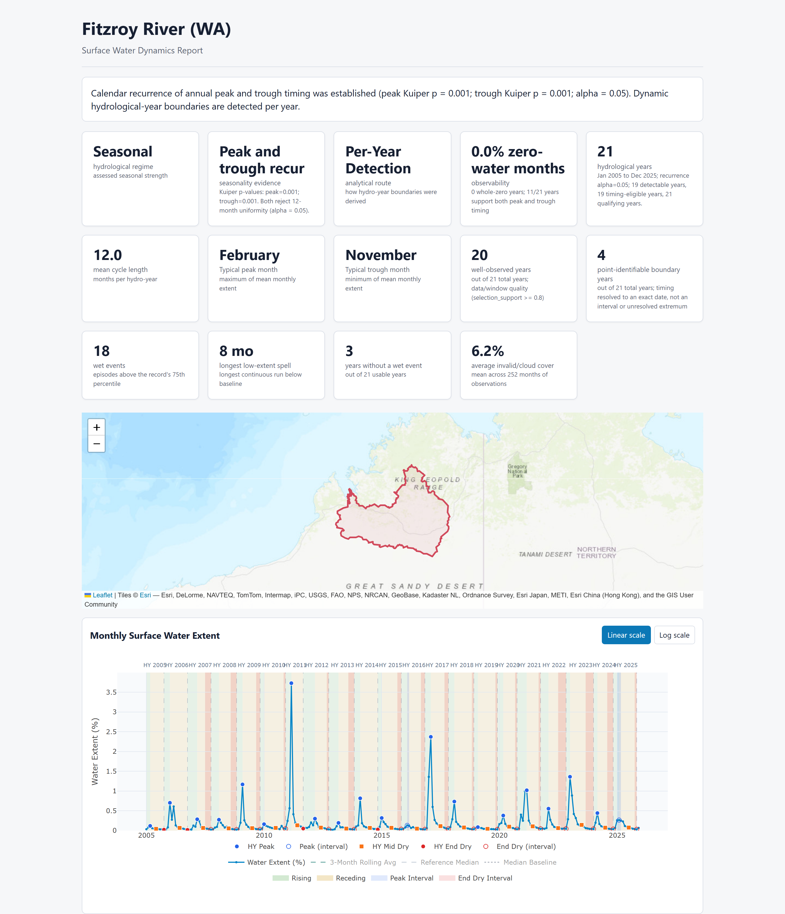

# HydroSeason

Remote-sensing-first hydrological year detection and regime routing from **monthly surface-water extent**.

HydroSeason detects wet/dry timing, hydrological year boundaries, and inundation regimes in satellite-derived water-mask time series (such as Digital Earth Australia Water Observations).

> [!NOTE]
> HydroSeason analyzes surface-water extent percentages. It does **not** estimate river discharge, channel depth, total water volume, or groundwater storage.

---

## What you get

[](examples/fitzroy-river-wa.html)

One self-contained HTML report plus four CSVs per catchment, from one call
to `run_hydroseason`. Live examples:
[Fitzroy River](examples/fitzroy-river-wa.html) (seasonal regime) ·
[Lachlan River](examples/lachlan-river-nsw.html) (aseasonal regime) ·
[Fitzroy + rainfall context](examples/fitzroy-river-wa-rainfall.html).

---

## Installation

```bash
pip install hydroseason              # Core: CSV detection & reports (pandas, numpy)
pip install "hydroseason[raster]"    # + xarray, rioxarray, rasterio, geopandas, dask, zarr
pip install "hydroseason[stac]"      # + pystac-client, odc-stac (DEA STAC acquisition)
pip install "hydroseason[all]"       # Complete raster + STAC dependencies
```

---

## Input Paths

| Input Type | Entry Point | Required Extra |
|---|---|---|
| Monthly extent CSV | [`load_extent_csv`](guide.md#path-1-extent-csv-lightweight-core-only) | Core only |
| Generic water-mask rasters / Zarr | [`load_monthly_masks`](guide.md#path-2-generic-rasters-or-local-zarr) | `[raster]` |
| Digital Earth Australia (DEA) STAC | [`open_wo_statistics`](guide.md#path-3-wofs-stac-acquisition) | `[stac]` |

---

## Quickstart

```python
from hydroseason import run_hydroseason

result = run_hydroseason(
    "monthly_extent.csv",
    output_dir="output/report",
    aoi_name="My AOI",
)

print(f"Regime: {result.analysis.regime.regime}")
print(f"Route: {result.analysis.route}")
print(f"HTML: {result.artifacts.html}")
```

See [Start here: one call](guide.md#start-here-one-call) in the Usage Guide
for the other three ways to run it (rasters/NetCDF/Zarr, DEA fetch, and
optional rainfall context), or call the lower-level building blocks
(`load_extent_csv`, `analyze_catchment`, `generate_catchment_report`)
directly — see [Advanced: calling the building blocks directly](guide.md#advanced-calling-the-building-blocks-directly).

---

## Navigation & Documentation

| Page | Contents |
|---|---|
| [User Guide](guide.md) | Start with `run_hydroseason`, the four ways to run it, routing, data quality, and advanced DEA internals |
| [Hydrological State](hydrological-state.md) | Dynamic years, trough diagnostics, and phase models |
| [Case Studies Overview](case-studies/index.md) | Three reproducible studies across five catchments |
| [Main Workflow Study](case-studies/main-workflow.md) | Case Study 1 — Route-aware analysis across 5 catchments |
| [Resolution & Acquisition Evidence](case-studies/resolution-and-acquisition.md) | Case Study 2 — Resolution fidelity and pruning benchmarks |
| [Rainfall Context](case-studies/rainfall-context.md) | Case Study 3 — Rainfall as strictly additive context |
| [Report Export Columns](report-columns.md) | CSV column dictionary for generated report bundles |
| [API Reference](api/index.md) | Public functions, classes, and exported entry points |
| [Citation](citation.md) | Software and paper citation details |
