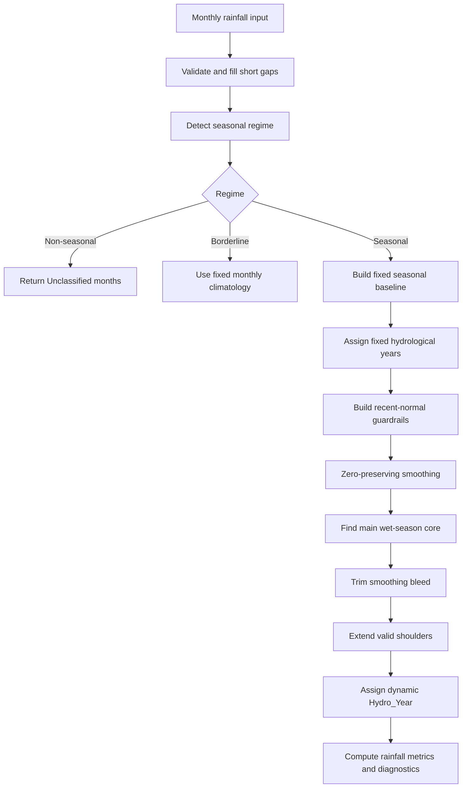

# Methods & Workflow

HydroSeason is a rainfall-first workflow for monthly wet/dry season and
hydrological-year delineation. It combines a whole-record seasonal baseline with
dynamic year-by-year wet-season detection, then applies recent-normal guardrails
so long records can adapt when climate seasonality shifts.

## Workflow Diagram

## Key Method Choices

HydroSeason first detects whether the record is seasonal, borderline, or
non-seasonal. Seasonal records use the full dynamic workflow. Borderline records
use the fixed monthly climatology as a conservative fallback, and non-seasonal
records are returned as `Unclassified`.

The fixed seasonal baseline is the long-record reference. By default it uses
circular climatology, which treats months as positions on a circle and identifies
the dominant wet-season timing. This gives a transferable baseline start month
without assuming that every catchment has the same wet season. For unimodal
records, the fixed Wet width is also adaptive: sharp peaks use 3 Wet months,
moderate peaks use 5, and diffuse peaks use 7.

The dynamic season step then works year by year. It smooths monthly rainfall
while preserving real zero-rain runs, finds the dominant wet-season core in each
fixed hydrological year, trims low-rainfall smoothing bleed, and extends only
valid build-up or recession shoulders.

Validation clips negative rainfall values to 0.0 and records a warning, because
rainfall totals cannot be negative. Annual SPI categories use the sample standard
deviation (`ddof=1`) of hydrological-year rainfall totals so short records match
the empirical Tayer et al. workflow.

## Recent Local Normal

Long rainfall records can contain real climate shifts. A 100-year record may
describe a historical wet season that is no longer the current local normal. To
avoid that, HydroSeason defaults to rolling recent-normal guardrails:

| Setting | Default | Purpose |
| --- | --- | --- |
| `climatology_window` | `rolling` | Use recent local climatology instead of only the full record. |
| `climatology_window_years` | `10` | Follow medium-term changes around each hydrological year. |
| `climatology_window_mode` | `trailing` | Use the previous/current years for operational-style analysis. |
| `climatology_min_month_observations` | `5` | Fall back when a local window is too sparse. |
| `climatology_min_wet_year_fraction` | `0.60` | Require persistence before a local Wet month is trusted. |

This means each hydrological year can be judged against rainfall behavior from
its nearby decade, not only against the whole record.

## Stability Guard

A shorter 10-year window is responsive, but it can also overreact to isolated
storms or short climate oscillations. HydroSeason mitigates that with a
persistence rule:

A month can become a stable recent Wet month only if it is locally labelled Wet
and at least 60% of observed years in the rolling window exceed the local tail
floor.

If a month fails that rule, HydroSeason does not let the local window lower the
core-trimming floor for that month. It uses the stricter global tail floor
instead. This keeps weak but real wet seasons intact, while preventing one-off
rainfall months from becoming part of the wet season.

## Shoulder Extension

Shoulder months are build-up or recession months adjacent to the wet-season
core. They can be Wet, but only when several gates agree:

| Gate | What it prevents |
| --- | --- |
| Tail floor | Low raw rainfall pulled in by smoothing. |
| Site-scaled climatology floor | Trivial rainfall in arid or low-rainfall sites. |
| Month-aware floor | Ordinary dry-season rain for that calendar month. |
| STL residual gate | Isolated storm anomalies. |

The default month-aware floor is the 0.60 calendar-month quantile. With a
10-year window, this means a shoulder must be above recent local normal for that
month, but it does not need to be an extreme upper-quartile event.

## Transferability

The workflow is designed to be transferable across rainfall regimes worldwide:
monsoonal, Mediterranean, arid, temperate, bimodal, and shifting climates. It
does not assume a fixed wet-season month, hemisphere, or regional calendar.
Transferability comes from using site-scaled thresholds, month-aware local
floors, data-quality fallbacks, and diagnostics that expose when rolling
guardrails were active or when global fallback was used.

For short records, sparse records, or low-confidence missing data, HydroSeason
falls back toward the global climatology. For long records with enough data, it
uses recent local normal so current conditions can matter more than distant
historical conditions.

---

See [Algorithm](algorithm.md) for technical and mathematical implementation details, parameter mappings, and step-by-step logic.
