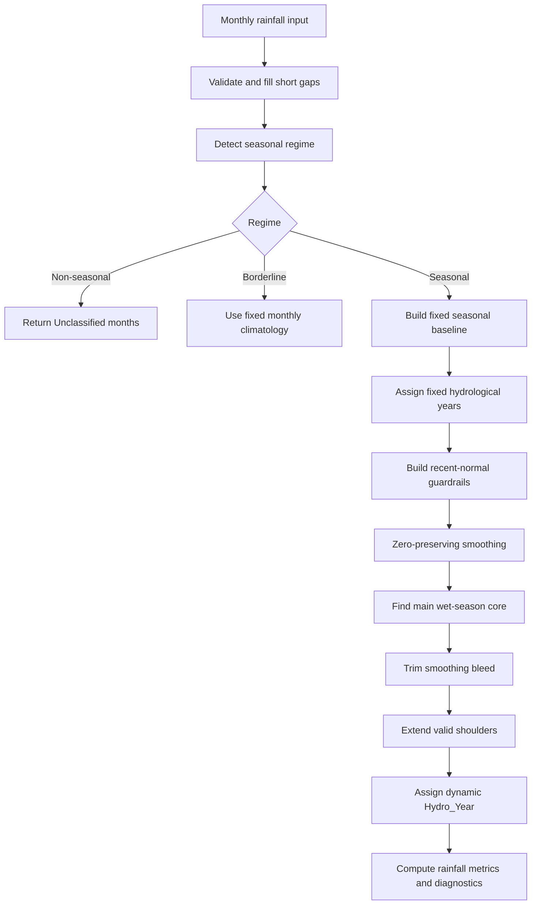

# Methods & Workflow

HydroSeason: rainfall-first workflow for monthly wet/dry season and hydrological-year delineation. Combines whole-record seasonal baseline with dynamic year-by-year wet-season detection, then applies recent-normal guardrails so long records adapt when climate seasonality shifts.

## Workflow Diagram

## Key Method Choices

HydroSeason first detects whether record is seasonal, borderline, or non-seasonal. Seasonal records use full dynamic workflow. Borderline records use fixed monthly climatology as conservative fallback. Non-seasonal records returned as `Unclassified`.

Fixed seasonal baseline is long-record reference. Default: circular climatology — treats months as positions on circle, identifies dominant wet-season timing. Gives transferable baseline start month without assuming same wet season for every catchment. For unimodal records, fixed Wet width is adaptive: sharp peaks use 3 Wet months, moderate use 5, diffuse use 7.

Dynamic season step works year by year: smooths monthly rainfall while preserving real zero-rain runs, finds dominant wet-season core per fixed hydrological year, trims low-rainfall smoothing bleed, extends only valid build-up/recession shoulders.

Validation clips negative rainfall values to 0.0 and records warning — rainfall totals cannot be negative. Annual SPI categories use sample standard deviation (`ddof=1`) of hydrological-year rainfall totals so short records match empirical Tayer et al. workflow.

## Recent Local Normal

Long rainfall records can contain real climate shifts. 100-year record may describe historical wet season no longer current local normal. HydroSeason defaults to rolling recent-normal guardrails:

| Setting | Default | Purpose |
| --- | --- | --- |
| `climatology_window` | `rolling` | Use recent local climatology instead of only full record. |
| `climatology_window_years` | `10` | Follow medium-term changes around each hydrological year. |
| `climatology_window_mode` | `trailing` | Use previous/current years for operational-style analysis. |
| `climatology_min_month_observations` | `5` | Fall back when local window too sparse. |
| `climatology_min_wet_year_fraction` | `0.60` | Require persistence before local Wet month trusted. |

Each hydrological year judged against rainfall behavior from nearby decade, not only whole record.

## Stability Guard

10-year window is responsive but can overreact to isolated storms or short climate oscillations. HydroSeason mitigates with persistence rule:

Month becomes stable recent Wet only if locally labelled Wet and ≥60% of observed years in rolling window exceed local tail floor.

If month fails that rule, HydroSeason does not let local window lower core-trimming floor for that month — uses stricter global tail floor instead. Keeps weak but real wet seasons intact while preventing one-off rainfall months from becoming part of wet season.

## Shoulder Extension

Shoulder months (build-up or recession adjacent to wet-season core) can be Wet only when several gates agree:

| Gate | What it prevents |
| --- | --- |
| Tail floor | Low raw rainfall pulled in by smoothing. |
| Site-scaled climatology floor | Trivial rainfall in arid or low-rainfall sites. |
| Month-aware floor | Ordinary dry-season rain for that calendar month. |
| STL residual gate | Isolated storm anomalies. |

Default month-aware floor: 0.60 calendar-month quantile. With 10-year window, shoulder must be above recent local normal for that month, but not extreme upper-quartile.

## Transferability

Workflow designed to transfer across rainfall regimes worldwide: monsoonal, Mediterranean, arid, temperate, bimodal, shifting. Does not assume fixed wet-season month, hemisphere, or regional calendar. Transferability from site-scaled thresholds, month-aware local floors, data-quality fallbacks, diagnostics exposing when rolling guardrails were active or global fallback used.

For short/sparse records or low-confidence missing data, falls back toward global climatology. For long records with enough data, uses recent local normal so current conditions matter more than distant historical ones.

---

See [Algorithm](algorithm.md) for technical and mathematical implementation details, parameter mappings, and step-by-step logic.
