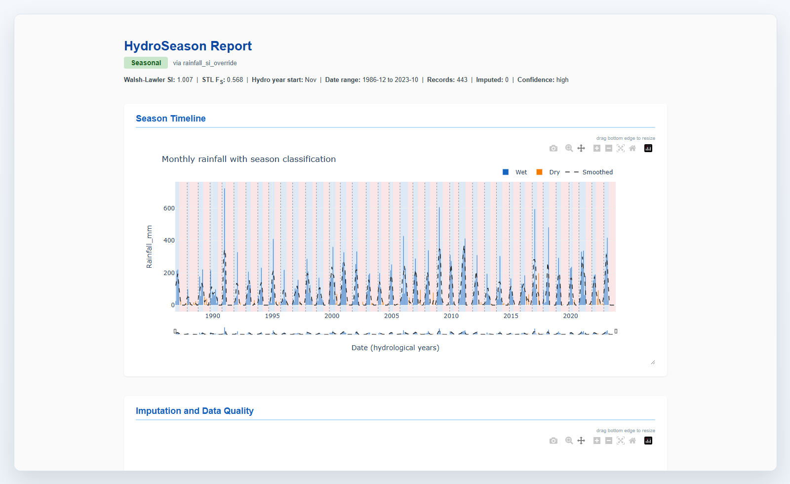

# Example Report

HydroSeason can export a self-contained interactive HTML report with the season
timeline, data-quality overview, aggregated monthly rainfall, annual Wet/Dry totals, STL
diagnostics, algorithm diagnostics, and per-hydrological-year metrics.

[Open the full interactive example report](examples/hydroseason_report.html){ .md-button .md-button--primary }

## Embedded Preview

The embedded report below is the same standalone HTML file produced by
`generate_html_report(...)` from the bundled example rainfall dataset.

<iframe
  src="../examples/hydroseason_report.html"
  title="HydroSeason example report"
  style="width: 100%; min-height: 760px; border: 1px solid #CFD8DC; border-radius: 6px; background: white;"
  loading="lazy">
</iframe>
